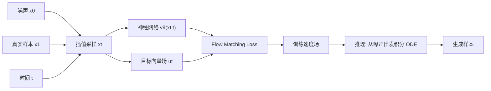

# dome-cfm开发日志

## FlowMatching



## 一、dome-cfm v1

Flow matching中的随机变量：`x = occupancy latent` 

DOME输入：

- $x_{t,occ}$

- $t$
- Real_poses condition

DOME输出：

- $v_{occ}$

条件：

- traj
- poses


## 二、dome-cfm v2

### （一）大概思路

#### 1. 模型输入部分

- occ_start:

  (B, F, 64, 25, 25)

-  traj_start:

  (B, F, D_traj)

 其中 D_traj 可以先用当前已有的：

-  D_traj = 2

-  rel_poses: dx, dy

 如果以后要加 yaw，可以变成：

- D_traj = 3

- dx, dy, dyaw

 FlowMatching 内部采样两个 noise：

- noise_occ: same shape as occ_start

- noise_traj: same shape as traj_start

 所以模型实际输入应该变成：

 DOME(

  	occ_t,

  	traj_t,

 	 t,

  	optional_conditions

 )

#### 2. 模型输入

- v_occ:  (B, F, 64, 25, 25)

- v_traj:  (B, F, D_traj)

loss_occ = MSE(v_occ, u_occ)

loss_traj = MSE(v_traj, u_traj)

#### 3. 条件

对应的condition也应该做出相应修改

### （二）具体实施方案

#### 1. JointFlow配置

```python
sample = dict{
      sample_method='joint_flow',
      n_conds=4,
      traj_key='rel_poses',
      traj_start_index=4, #从第四帧开始取
      traj_len=6,
      traj_dim=2,
      traj_loss_weight=10.0,
      num_command_modes=3, #三种命令
}

```

#### 2. dataloader

训练loop从数据集`dataset/dataset.py`中接受：`input_occs`,`target_occs`,`metas`

##### 1）input_occs 

(B, 11, 200, 200, 16)，数值为语义标签

##### 2）target_occs

(B, 11, 200, 200, 16)，数值为语义标签，时间与input_occs对齐

##### 3）metas

```python
metas = {
      'rel_poses': ...,
      'gt_mode': ...,
      'traj_mode': ...,
      'e2g_t': ...,
      'e2g_r': ...,
      'e2g_rel0_t': ...,
      'e2g_rel0_r': ...,
      'rel_poses_yaws': ...,
      'scene_token': ...
  }
```

- Rel_poses: (11, 2)， 用来当未来轨迹的监督

描述每一帧车应该怎么动，即$(\mathbf{d}x, \mathbf{d}y)$，在joint版本里会拿未来六帧

- gt_mode : (11, 3)，用来当navigation command

每一帧是一个3类的onehot标签，描述每一帧是直行，左转还是右转

- Traj_mode: 对gt_mode的计算结果

Traj_mode = 0: right

- Ego_t: (11, 3)

描述每一帧ego在全局坐标系里的位置

- Ego_r: (11, 4)

每一帧ego车在全局坐标系里的朝向

**总结：**这里的meta并不是为了给DOME注入clean pose，而是给Joint Flow提供future trajectory target / command

#### 3. OccVAE

对occ进行编码，写为latent，形状为 (B, 11, 64, 25, 25)

这也是Joint flow里occ分支的$x_1$

#### 4. JointFlow输入数据预处理

输入： 

```python
x_start:

  shape = (B, 11, 64, 25, 25)

  meaning = 真实 occupancy latent

 model_kwargs['metas']:

  length = B

  meaning = 轨迹和 command 来源
```

对metas提取future trajectory，得到traj_start，下面为JointFlow的输入（预测变量）
$$
x_{11} = \mathbf{latent}(B,11,64,25,25) \\ \\ x_{12} = \mathbf{traj}(B,6,2)
$$


对metas提取command，作为条件注入

#### 5. 噪声采样、状态构建以及条件帧替换

1. 分别采样对应形状的高斯噪声
2. 构造中间状态和速度目标
3. 对Occ进行条件帧替换，Traj不做条件帧替换

#### 6. JointFlow完整输入

```python
x_t:
    shape = (B, 11, 64, 25, 25)
    meaning = noised occupancy latent
  t * 1000:
    shape = (B,)
    meaning = DOME timestep embedding 使用的时间
  traj_t:
    shape = (B, 6, 2)
    meaning = noised future trajectory
  commands:
    shape = (B,)
    meaning = right / left / straight command id
  metas:
    原始 metas，这里 JointDome 基本不再用 clean rel_poses 注入

```

#### 7. Tokenizer

- 对原始occ做patch embedding：

（B, 11, 64, 25, 25) -> (B*11, 625, 768)

- 对timestep和command做embedding
- 对noised traj做embedding得到ego token：

 dx,dy -> Fourier features -> MLP -> per-step features -> flatten/project，最终得到的输出形状为(B, 768)

#### 8. Attention

### （三）训练情况

成功开始训练


### 三、dome-cfm v3

### （一）DOMEv2失败原因分析


可以看到**IoU和mIoU**这两项指标很早就已经饱和，**L2**指标还算正常，分析原因如下：

#### 1. Train loss调配问题

$$
\mathbf{Loss}  = \mathbf{Loss}_{occ} + \mathbf{Loss}_{traj}
$$

而观察实验数据指标可以发现，$\mathbf{Loss}_{traj}$占据了总损失的绝大部分，因此优化的时候会优先对Traj进行优化

- 优化的是Grad和并非直接是Loss，二者之间的关系？
- 如何调配多模态Loss

#### 2. Condition注入问题

DOMEv1版本中，条件注入是比较强的，进行Occ预测时，可以看到完整的ego motion，因此Occ训练结果比较好

- Occ指标与条件的关系？

DOME的条件过于强了，所以注入的时候只做了简单的相加，架构是比较简单的，条件减弱后需要改进注入的方式。

### （二）DOMEv3改进方向

#### 1. 降低Loss weight

目前先尝试手动调低Loss weight

- GradNorm等优化方法？

#### 2. Noised Latent和Condition要分离

- AdaLN？

### （三） dome-cfm v3实现方案

#### 1. Loss权重改进

$\mathbf{Loss}_{occ}$和$\mathbf{Loss}_{traj}$的权重调整为1:1

### 2. 增加planning判定指标

添加了OccWorld/STP3 风格 planning metric，包括 L2、碰撞指标

### 3. Traj Decoder方式改变

采用Attention Pooling解模态轨迹

### 4. Traj token也参与Temporal attention

### 5. 轨迹建模改为完整的token序列

JointDomeCFMV5 保留 6 个轨迹 token，把它们和 occupancy patch token 一起放进 backbone，参与 spatial 和 temporal attention

### （三）实验结果


## 四、DOMEv4

#### 1. 其他领域多模态融合相关调研

##### 1. **UniDiffuser**：全局concat流派

One Transformer Fits All Distributions in Multi-Modal Diffusion (https://arxiv.org/abs/2303.06555)

他的本质思想是：比如说我们只做Occ的时候，traj是真实的，可以看作是**Occ加了噪声，但是Traj没有加噪声**；我们做Occ和Traj的时候，**是对Occ和Traj都添加了噪声**，这就把occ only和joint**统一**起来了，就可以扔到一个模型上一起训练

可以形式化表示为：

1. 把我们的任务写成统一的多条件 joint flow：$p(occ), p(traj), p(occ | traj), p(traj | occ), p(occ, traj)$
2. 训练时不再只用一个共同 timestep，而是：

```python
occ_t = interpolate(noise_occ, occ_gt, t_occ)
traj_t = interpolate(noise_traj, traj_gt, t_traj)
model(occ_t, traj_t, t_occ, t_traj, command, history) -> v_occ, v_traj
```

 不同 (t_occ, t_traj) 对应不同任务：

- t_traj = 1, t_occ 随机 -> traj clean, 训练 occ | traj

- t_occ = 1, t_traj 随机 -> occ clean, 训练 traj | occ

- t_occ 随机, t_traj 随机 -> 训练 joint generation

- t_occ 随机, traj masked -> occ-only

3. 他是做全局concat，也就是所有帧的occ和traj都拼到一起，算力开销巨大

##### 2. OmniFlow/MMDiT/IP-Adapter：只做两个模态之间的Cross-attention

他们工作的思路是把Occ和Traj各自走一个stream然后，做Attention交互

这样的话Occ和Traj的耦合效果会弱一些，不知道效果怎么样


##### 3. finetune流派

- ControlNet：把T2L backbone锁住，训练一个分支
- T2I-Adapter：也是冻结大 T2I diffusion，只训练轻量 adapter
- CoDi：两个模态先独立训练，再做一个bridge adapter对齐

#### 2. 自动驾驶Plan和Occ关系相关调研

##### 1. Occ作为planner中间表征

ST-P3、UniAD、OccNet等

##### 2. Plan作为条件注入

DOME、OccWorld

##### 3. **双分支迭代 refinement**

OccDriver OpenReview (https://openreview.net/forum?id=abJCjkIwi5)，

ICLR 2026 poster (https://iclr.cc/virtual/2026/poster/10008686)

OccDriver，和我们的思路有些相同之处的，但是他还是明显更侧重plan的相关指标，论文里没见到Occ的指标，更像是用Occ去对plan做强化。


